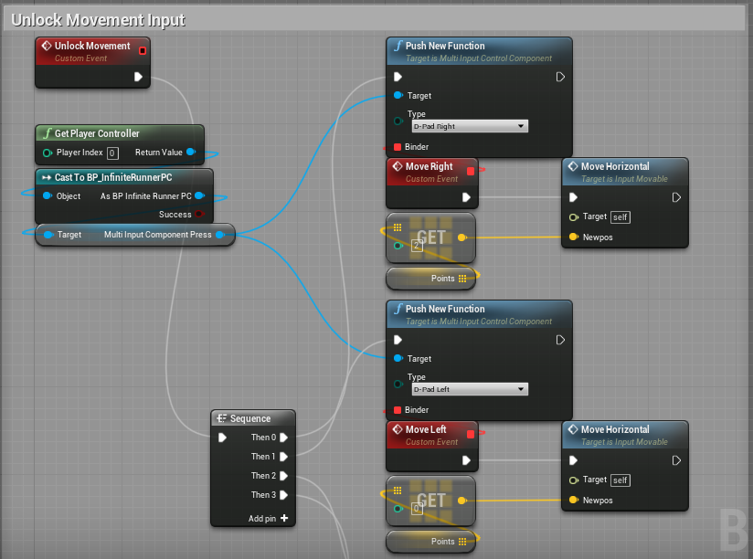
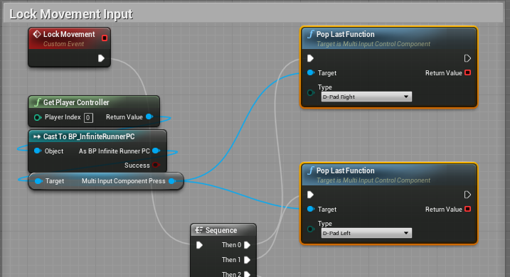
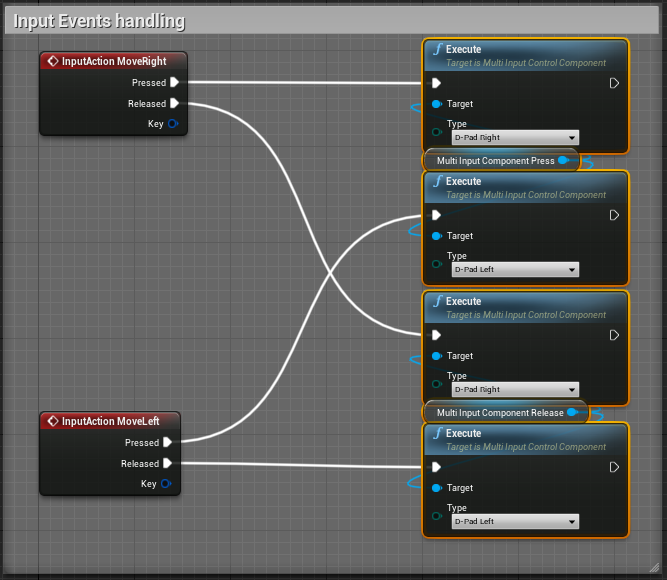
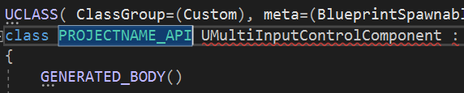
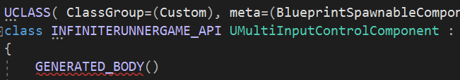

# CUSTOM INPUT SYSTEM

Here i post a custom Input system i've created some time ago,  
in order to work better with Unreal Input and Binding systems.  
I've made this in order to save some time for the next projects where i'll use this,  
and to show what i've done to who's interested in some home made code.

## HOW IT WORKS

* `InputContainerDispatcher` contains the Events triggered by its assigned button;
* `MultiInputPlayerController` is the Player Controller where handles Input Containers;
* `MultiInputControlComponent` is the Component that handles Input Containers  
    (alternative of `MultiInputPlayerController`);
  

In my projects i use to handle Input Events in mevery Player Controller (-> PC for short),  
because i follow the thinking where the Character is the puppet that gives  
the way how it moves to the Player Controller, the brain.  
So my idea is to Bind and Unbind the Character's events to and from the Queue from its Blueprint in this way  
  
  

and Handle Input Events from the PC like this  
`(Here i used two components to handle Press and Release Events. Pretty cool)`  
  
by choosing from two methods:
* Inheriting the PC from the `MultiInputPlayerController` class;  
    or
* Adding the `MultiInputControlComponent` to your PC;  

## HOW TO INSERT IT IN YOUR PROJECT

You can easily put the files in your project by:  
1. Cloning the 'Source' folder content inside the 'Source' folder;
2. Changing every Class API text with the PROJECT's NAME + _API like in the example below  

  

  

## IN CONCLUSION

I hope you find this code useful and easy to use
